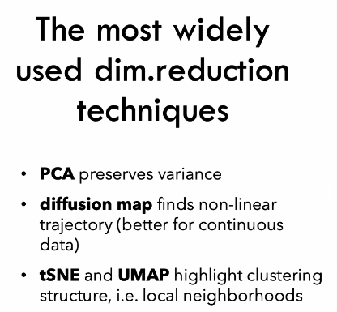
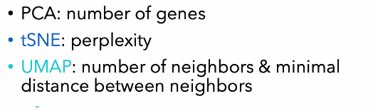
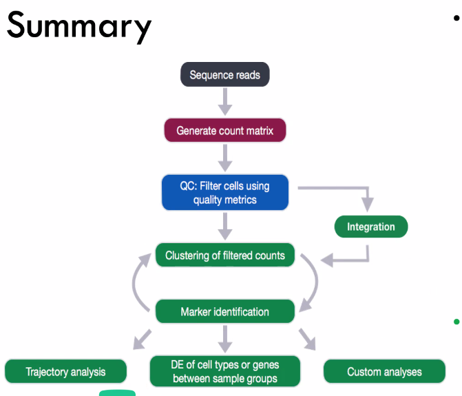
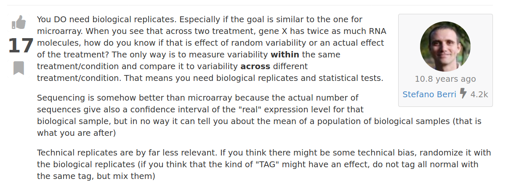

```{r setup, include=FALSE}
knitr::opts_chunk$set(echo = TRUE)
```

## Q and A from lecture

-   scRNA-seq has low sensitivity

    -   droplets -- more cells
    -   combining with bulk RNA-seq

-   For **good** 10x genomics run, we expect to see 5% of doublets

    -   Can be detected by marker genes of multiple cell types present in the same GEM well

## scRNA-seq

First step of scRNA-seq is typically to **identify cell types and states** using gene expression patterns.

Current methods are a little round-about:

-   Determine cell type by gene expression

-   Perform differential expression analysis between different assigned cell types

`SingleCellExperiment` object

Almost all downstream analyses rely on a much smaller matrix than the original gene x cell matrix

-   In order to filter genes that primarily contribute noise rather than biologically meaningful info

-   Want to capture 80-85% of the variance (5-15 PCs)



Parameters for reduction techniques:



[distill.pub/2016/misread-tsne](distill.pub/2016/misread-tsne)

[pair-code.github.io/understanding-umap](pair-code.github.io/understanding-umap)

Use `set.seed()` when using t-SNE and UMAP!

## Clustering

Clustering is usually the next step after visualizing our scRNA-seq data

-   PCA + graph-based methods seem to work the best here

Graph:

-   Nodes: cells

-   Edges: similarity connections

-   Clusters: groups of nodes that are densely connected

-   Note: **Clustering algorithms cluster no matter what!** -- even if there is no structure or clusters to the data

Have to make choices on:

-   What genes go into PCA

-   How many PCs we use

-   Settings specific to the clustering algorithm

One question to have:

-   How well does the clustering results agree with UMAP / tSNE results?

-   Watch out for ribosomal DNA or cell cycle genes! They have strong power for differentiating cells, but no in the biologically meaningful

## Pseudo-bulk Analysis

Aggregate all cells within the same cluster **from the same sample**

`SingleR` package allows semi-automated annotation when an appropriate reference data set is provided

## Trajectory analysis

Pseudotime

question: isn't there muliple cyclic processes occurring?

RNA velocity

[osca.bioconductor.org](osca.bioconductor.org)

SLINGSHOT -- library for sc-Tragjectory analysis




Monday: Live presentation from Alicia Alonso \@ 10:15

Touch up on the basics of illumina sequencing

## Why RNA-seq needs biological replicates


