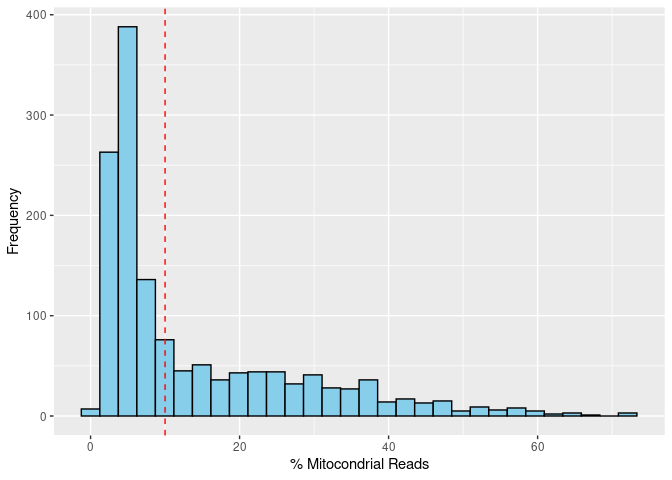

# **Wrangling scRNA-seq data in R using bioconductor packages**

A report by **Jake Sauter**

date: 3/26/2021

## **Loading the Data**

The file `data/WT-1.dge.txt` will be used during this assignment for demonstrating various Bioconductor objects and methods. A sparse matrix will be used to store this data as there are relatively few non-zero entries in comparison to zero entries.


```r
library(Matrix)

data_file <- '../data/WT-1.dge.txt'


mat <- 
  read.table(file = data_file, 
             header = TRUE, 
             row.names = 1, 
             sep = '\t') %>%
  as.matrix()


sparse_mat <- Matrix(mat, sparse = TRUE)

pryr::object_size(mat)
```

```
144 MB
```

```r
pryr::object_size(sparse_mat)
```

```
25.5 MB
```

## **Creating a `SingleCellExperiment` object**

We will now create a `SingleCellExperiment` object from the count matrix we have read into `R` in the last step. We note that [Orchestrating Single-Cell Analysis with Bioconductor](https://bioconductor.org/books/release/OSCA/data-infrastructure.html) (specificaly chapter 4) was used in reference for this step.

> <font size=2.5> the SingleCellExperiment class (from the SingleCellExperiment package) serves as the common currency for data exchange across 70+ single-cell-related Bioconductor packages. This class implements a data structure that stores all aspects of our single-cell data - gene-by-cell expression data, per-cell metadata and per-gene annotation (Figure 4.1) - and manipulate them in a synchronized manner. </font>


```r
# BiocManager::install('SingleCellExperiment')
library(SingleCellExperiment)
```


```r
sparse_mat %>% 
  rownames() %>% 
  head()
```

```
[1] "A1BG"      "A1BG-AS1"  "A2ML1"     "A2ML1-AS1" "A2ML1-AS2" "A4GALT"   
```


```r
sparse_mat %>% 
  colnames() %>% 
  head()
```

```
[1] "GGTCCAGATCAT" "CCCCCATTATGC" "TTTACCTAACAG" "ATTCCCGAGTCA" "ATTCATTCTTTG"
[6] "GTCTTCTCCCAT"
```

We see that are `sparse_mat` matrix is a **genes vs cell barcodes** matrix.


```r
sce <- 
  SingleCellExperiment(
    assays = list(counts = sparse_mat)
  )

sce
```

```
class: SingleCellExperiment 
dim: 25319 1400 
metadata(0):
assays(1): counts
rownames(25319): A1BG A1BG-AS1 ... ZZZ3 hsa-mir-1273e
rowData names(0):
colnames(1400): GGTCCAGATCAT CCCCCATTATGC ... TCCCTTTATCAT CGCCTTCTAATC
colData names(0):
reducedDimNames(0):
altExpNames(0):
```

We can see a small part of the count matrix that is now apart of the `sce` object in the following way:


```r
sce %>% 
  counts() %>%
  .[1:6, 1:3] %>% 
  as.matrix() %>% 
  kable()
```


|          | GGTCCAGATCAT| CCCCCATTATGC| TTTACCTAACAG|
|:---------|------------:|------------:|------------:|
|A1BG      |            0|            0|            0|
|A1BG-AS1  |            0|            0|            0|
|A2ML1     |            0|            0|            0|
|A2ML1-AS1 |            0|            0|            0|
|A2ML1-AS2 |            0|            0|            0|
|A4GALT    |            0|            0|            0|

## **Calculating Sequencing Depth**

**Calculate the numbers of reads (\~ sequencing depths) for the first five cells.**


```r
sce %>% 
  counts() %>%
  .[, 1:5] %>% 
  colSums() %>% 
  kable(col.names = 'Counts')
```


|             | Counts|
|:------------|------:|
|GGTCCAGATCAT |  42572|
|CCCCCATTATGC |  33667|
|TTTACCTAACAG |  30704|
|ATTCCCGAGTCA |  28555|
|ATTCATTCTTTG |  25858|

**How many genes have non-zero counts in the first five cells?**


```r
sce %>% 
  counts() %>%
  .[, 1:5] %>% 
  apply(2, function(x) sum(x!=0)) %>% 
  kable(col.names = 'Counts')
```


|             | Counts|
|:------------|------:|
|GGTCCAGATCAT |   7416|
|CCCCCATTATGC |   7092|
|TTTACCTAACAG |   6815|
|ATTCCCGAGTCA |   6216|
|ATTCATTCTTTG |   6166|

**If you were to change the row- and column-names of the original matrix, how could you keep track of the original names?**

We could store a data frame mapping these values to eachother in the colData attribute of the `sce` object.


```r
colData(sce) <- 
  DataFrame(barcode = colnames(sparse_mat), 
            cell_name = sample(colors(), 1400, replace = TRUE))

colData(sce) %>% 
  as.data.frame() %>% 
  head() %>% 
  kable()
```


|barcode      |cell_name      |
|:------------|:--------------|
|GGTCCAGATCAT |darkgray       |
|CCCCCATTATGC |palevioletred3 |
|TTTACCTAACAG |rosybrown2     |
|ATTCCCGAGTCA |mistyrose2     |
|ATTCATTCTTTG |slategray1     |
|GTCTTCTCCCAT |skyblue        |

## **Scater Workflow**

[Single-cell analysis toolkit for expression in R (scater) workflow](https://bioconductor.org/packages/release/bioc/vignettes/scater/inst/doc/overview.html#3_quality_control).

### **Detected features vs UMI Count by Cell**


```r
# BiocManager::install("scater")
library(scater)

sce <- 
  addPerCellQC(sce, 
               subsets=list(
                   Mito= grep("MT-", rownames(sce))
              ))
sce %>% 
  colData() %>% 
  as.data.frame() %>% 
  ggplot() + 
  geom_point(aes(x = sum, y=detected), 
            col = 'deepskyblue') +
  xlab('Sum of UMI Counts (by Cell)') + 
  ylab('Number of Detected Features (by Cell)')
```

<!-- -->

We see that as we expect, as more UMIs are detected per cell, more features (genes / transcripts) are also detected per cell, a good sign of the viability of the cell's sequenced.

### **Percent** ​Mitochondrial **Reads vs UMI Count by Cell**


```r
sce %>% 
  colData() %>% 
  as.data.frame() %>% 
  ggplot() + 
  geom_point(aes(x = sum, 
                 y=subsets_Mito_percent), 
             col = 'deepskyblue', 
             alpha = 0.3)+ 
  xlab('Total UMI Count (per Cell)') + 
  ylab('% Mitochondrial Reads') + 
  geom_hline(aes(yintercept = 10), lty=2, col = 'red')
```

<!-- -->

We see above that there does appear to be a subset of our cell population that contain many ​mitochondrial reads. Indicated by the red dotted line above, when processing this data I will choose to filter for cells that have **at least** less than 10% mitochondrial reads.

### **Total number of UMI counts per cell**

**Generate histogram or density plot of total number of UMI counts per cell.**


```r
sce %>% 
  counts() %>%
  colSums() %>% 
  log10() %>%
  data.frame(counts = .) %>% 
  ggplot() + 
  geom_histogram(aes(x = counts), 
                 bins = 50, 
                 color='black', 
                 fill='skyblue') + 
  geom_vline(aes(xintercept=2.5), 
             col = 'red', lty=2) + 
  xlab("Log-total UMI Count") + 
  ylab("Frequency") + 
  ggtitle('Log_10 UMI Count Per Cell')
```

<!-- -->

This histogram tells us that we have collected bewteen 100 and 1000 UMIs for most cells, with some cells yielding 10,000 UMIs, and some cells containing very few. The cells contining very few UMI may not be viable and will be filtered in the QC steps to follow. The red-dotted line indicates cells containing below 300 UMIs.

### **Total number of expressed genes**


```r
# BiocManager::install("scater")
library(scater)

sce %>% 
  counts() %>%
  rowSums() %>%
  log10() %>% 
  data.frame(cell = names(.), counts = .) %>% 
  ggplot() + 
  geom_histogram(aes(x = counts), 
                 bins = 30, 
                 color='black', 
                 fill='skyblue') + 
  xlab("Log-total # of expressed features") + 
  ylab("Frequency") + 
  ggtitle('Number Genes Expressed Per Cell') 
```

<!-- -->

We see that on average, around 100 features are collected per cell, with a build-up of cells in which our assay returned fewer features. These cells in which fewer features were returned could have contained mainly mitochrondrial reads, or could be smaller, or dying cells. We hope to get rid of these cells by filtering for UMI count, and mitochondrial read percentage.

### **Percent Mitochondrial Reads**


```r
colData(sce) %>% 
  as.data.frame() %>% 
  ggplot() + 
  geom_histogram(aes(x = subsets_Mito_percent), 
                 bins = 30, 
                 color='black', 
                 fill='skyblue') + 
  geom_vline(aes(xintercept=10), 
             lty = 2, col = 'red') + 
  xlab('% Mitocondrial Reads') + 
  ylab('Frequency')
```

<!-- -->

We see that some cells contain a large portion of mitochondrial reads. This could be a bad sign for the other features in the cell, and thus we will filter for cells that have at least less than 10% mitochondrial reads (indicated by the red-dotted line), however we may choose to be even stricter than this by only allowing 3-5% of mitochondrial reads.

### **Quality Control**

I will filter for cells that:

-   Have less than 5% mitochondrial reads
-   Express more than 300 features


```r
cells_to_keep <-
  colData(sce) %>% 
  as.data.frame() %>% 
  filter(subsets_Mito_percent < 5, 
         detected > 300) %>% 
  .$barcode

cells_to_keep <- 
  which(colData(sce)$barcode %in% cells_to_keep)

qc_sce <- sce[, cells_to_keep]
```

## **Count Normalization**

**Using the filtered data set, normalize the counts using scran and scater and judge whether the size factors calculated by computeSumFactors show the expected behavior as shown in the figure below.**

{width="493"}


```r
# BiocManager::install('scran')

qc_sce <- 
  scran::computeSumFactors(qc_sce)

assay(qc_sce, "normed") <- 
  normalizeCounts(qc_sce, log=TRUE)

qc_sce %>% 
  colData() %>% 
  as.data.frame() %>% 
  ggplot() + 
  geom_point(aes(x = total, y = sizeFactor), 
             alpha = 0.2) +
  scale_x_continuous(trans='log10') +
  scale_y_continuous(trans='log10') +
  xlab('Total Counts') + 
  ylab('Size Factor')
```

<!-- -->

This above graph may or may not show the expected behavior of the example plot above. Our size factors do not seem to be **as** clustered around one as in the example plot, however a large amount of cells do fall within a relatively close range of a size factor of one, leading me to believe more analysis required to undersand the underlying sizeFactor distribution.

**How can you access the normalized data matrix?**


```r
assay(qc_sce, 'normed') %>% 
  str()
```

```
Formal class 'dgCMatrix' [package "Matrix"] with 6 slots
  ..@ i       : int [1:1064051] 6 7 14 15 17 19 20 21 22 23 ...
  ..@ p       : int [1:502] 0 7416 14231 20447 26754 32762 39041 44826 50962 56572 ...
  ..@ Dim     : int [1:2] 25319 501
  ..@ Dimnames:List of 2
  .. ..$ : chr [1:25319] "A1BG" "A1BG-AS1" "A2ML1" "A2ML1-AS1" ...
  .. ..$ : NULL
  ..@ x       : num [1:1064051] 0.166 0.316 0.451 0.574 0.166 ...
  ..@ factors : list()
```

## **Dertermining Cell Type**

Below we will use the `SingleR` package, with the `HumanPrimaryCellAtlasData()` as our reference to compare our single-cell gene expression profiles to. Two distinct cell types are returned between the population as `fist.label`, shown in the below histogram.


```r
# BiocManager::install('SingleR')
library(SingleR)
ref1 <- HumanPrimaryCellAtlasData()
ref2 <- BlueprintEncodeData()

pred1 <- SingleR(test=qc_sce,
                 ref=ref1,
                 labels=ref1$label.main,
                 assay.type.test='normed')

pred2 <- SingleR(test=qc_sce,
                 ref=ref2,
                 labels=ref2$label.main,
                 assay.type.test='normed')

pred1 %>% 
  as.data.frame() %>% 
  select(first.labels) %>%
  ggplot() +
  geom_histogram(aes(x = first.labels),
                 fill = c('dodgerblue', 'darkorange'),
                 stat = 'count') +
  xlab('First Predicted Labels') +
  ylab('Frequency') 
```

<!-- -->

```r
pred2 %>% 
  as.data.frame() %>% 
  select(first.labels) %>%
  ggplot() +
  geom_histogram(aes(x = first.labels),
                 stat = 'count') +
  xlab('First Predicted Labels') +
  ylab('Frequency') + 
  theme(axis.text.x = element_text(family = "Times",  
                                   angle = -30))
```

<!-- -->

**Heatmap of Potential Cell Types**


```r
plotScoreHeatmap(pred1)
```

<!-- -->

```r
plotScoreHeatmap(pred2)
```

<!-- -->

**Predicted Cell Type**: Although the `SingleR` analysis above predicts that our top cell type is a Human Embryonic Stem Cell, I believe that it would be more likely that induced Pluripotent Stem Cells (iPSCs) would be more likely, given the difficulty in obtaining Human Embryonic Stem Cells, as well as the strong evidence when we used `BlueprintEncodeData()` reference that our cells closely match Fibroblasts and peripheral blood cells, a common source of iPSCs. It is also possible that our `HumanPrimaryCellAtlasData` reference is not well aligned with our sample, and our `BlueprintEncodeData` reference is correctly in predicting that our cell population is composed of ertyhrocytes and fibroblasts.